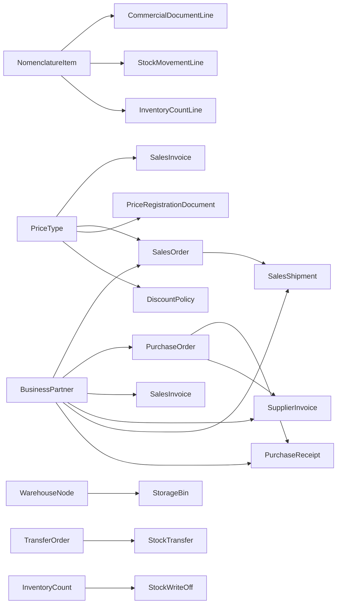

# 1C Domain Model Draft

Эта модель собрана не "с потолка", а по реальным полям и табличным частям из выгрузки 1С в папке `model_schema`.

## Приоритетный функционал

- Продажи: покупатели, заказы покупателей, счета на оплату, расходные накладные.
- Закупки: поставщики, заказы поставщикам, счета поставщиков, приходные накладные.
- Склад: заказы на перемещение, резервы, инвентаризация, списания, склады и ячейки.
- Цены и скидки: номенклатура, виды цен, установка цен, автоматические скидки.

## Источники 1С

- `Catalog.Контрагенты` -> контрагенты, роли покупателя/поставщика, головной контрагент, ответственный, контактное лицо.
- `Catalog.Номенклатура` -> номенклатура, единица измерения, категория, поставщик, склад, ячейка, ценовая группа.
- `Catalog.ВидыЦен` -> вид цены, валюта, базовый вид цены, правила округления.
- `Catalog.АвтоматическиеСкидки` -> скидка, период действия, вид цены, получатели скидки, условия.
- `Catalog.Ячейки` -> иерархия ячеек и привязка к месту хранения.
- `Document.ЗаказПокупателя` -> заказ покупателя и строки запасов.
- `Document.СчетНаОплату` -> счет клиенту, строки, платежный календарь.
- `Document.РасходнаяНакладная` -> отгрузка, заказ-основание, перевозчик, склад/ячейка.
- `Document.ЗаказПоставщику` -> заказ поставщику, строки, связь с заказом покупателя.
- `Document.СчетНаОплатуПоставщика` -> счет поставщика, строки, платежный календарь.
- `Document.ПриходнаяНакладная` -> приемка, заказ поставщику, расходы, склад/ячейка.
- `Document.ЗаказНаПеремещение` -> распоряжение на перемещение между местами хранения.
- `Document.РезервированиеЗапасов` -> изменение места резерва по строкам запасов.
- `Document.ИнвентаризацияЗапасов` -> инвентаризация по складу/ячейке.
- `Document.СписаниеЗапасов` -> списание с опорой на склад, ячейку и документ-основание.
- `Document.УстановкаЦенНоменклатуры` -> регистрация цен по номенклатуре и виду цены.
- `Document.ПеремещениеЗапасов` -> сущность включена в модель, но поля пока частично выведены: probe-файл `stock-transfer.txt` поврежден и содержит только ошибку `Требуется объект`.

## Сущности

### Справочники

- `BusinessPartner`
  - роли: customer, supplier, carrier, consignee
  - self-reference: `ParentId`, `HeadPartnerId`
  - связи: `DefaultBankAccountId`, `ResponsibleEmployeeId`, `PrimaryContactId`
- `PartnerContact`
  - принадлежит `BusinessPartner`
- `PartnerContract`
  - связывает `BusinessPartner` и `Organization`
- `NomenclatureItem`
  - связи: `UnitOfMeasure`, `ItemCategory`, `DefaultSupplier`, `WarehouseNode`, `StorageBin`, `PriceGroup`
- `WarehouseNode`
  - единая сущность для склада, магазина, транзитной точки, delivery hub
- `StorageBin`
  - ячейка/подячейка внутри `WarehouseNode`
- `PriceType`
  - self-reference на `BasePriceTypeId`
- `DiscountPolicy`
  - может ссылаться на партнеров, места хранения, категории и ценовые группы

### Документы продаж

- `SalesOrder`
  - `CustomerId -> BusinessPartner`
  - `ContractId -> PartnerContract`
  - `PriceTypeId -> PriceType`
  - `WarehouseNodeId`, `ReserveWarehouseNodeId`, `StorageBinId`
  - строки `CommercialDocumentLine`
- `SalesInvoice`
  - опирается на `SalesOrder` или другой `BaseDocumentId`
  - содержит `CompanyBankAccountId`, `CashboxId`, `PaymentSchedule`
- `SalesShipment`
  - связь с `SalesOrder`
  - связь с `CarrierId`
  - складская привязка через `WarehouseNodeId` и `StorageBinId`

### Документы закупки

- `PurchaseOrder`
  - `SupplierId -> BusinessPartner`
  - может ссылаться на `LinkedSalesOrderId`
- `SupplierInvoice`
  - связь с `PurchaseOrder`
  - использует банковские счета организации и поставщика
- `PurchaseReceipt`
  - связь с `PurchaseOrder`
  - содержит `AdditionalCharges`
  - складская привязка через `WarehouseNodeId` и `StorageBinId`

### Складские документы

- `TransferOrder`
  - источник и получатель: `SourceWarehouseNodeId`, `TargetWarehouseNodeId`
  - может ссылаться на `CustomerOrderId`
- `StockTransfer`
  - фактическое перемещение по `TransferOrder`
- `StockReservationDocument`
  - связь с `SalesOrderId`
  - переводит резерв между `SourcePlace` и `TargetPlace`
- `InventoryCount`
  - фиксирует фактическое количество по складу/ячейке
- `StockWriteOff`
  - может ссылаться на `InventoryCountId`
  - списывает строки с ценой и суммами
- `PriceRegistrationDocument`
  - связывает `NomenclatureItem` + `PriceType` + цену

## Основные связи

## Что важно для будущей SQL-схемы

- Почти все важные связи уже видны как ссылочные поля в заголовках документов и табличных частях.
- Табличные части 1С лучше сразу раскладывать в отдельные SQL-таблицы строк.
- `Контрагенты` в 1С совмещают покупателей и поставщиков, поэтому в новой системе выгоднее оставить одну сущность `BusinessPartner` с ролями.
- `Склады и магазины` в UI пока лучше держать единой сущностью `WarehouseNode`, а уже потом делить на типы.
- `ПеремещениеЗапасов` нужно допробить отдельно, но для старта модели это не мешает: логическая связь `TransferOrder -> StockTransfer` уже очевидна.
